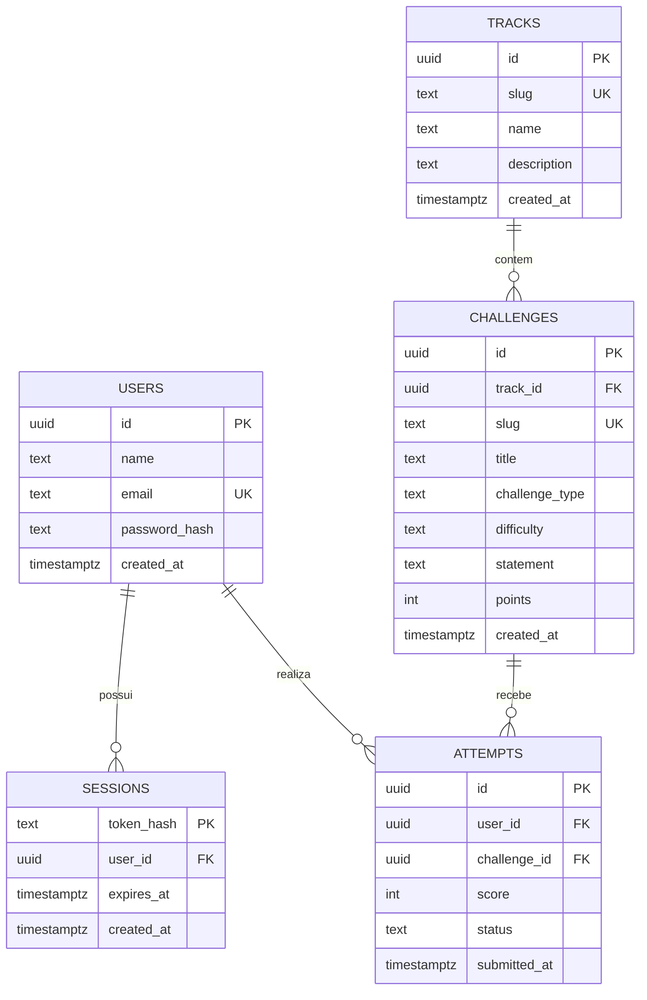

# DER do CODADO

`USERS` e `SESSIONS` representam a autenticacao existente. Uma trilha possui muitos desafios, e cada tentativa liga um usuario a um desafio. O ranking nao e armazenado: o XP e calculado pela soma de `attempts.score` para tentativas com status `passed`. A exclusao de um usuario remove suas sessoes e tentativas; a exclusao de um desafio e bloqueada quando existem tentativas relacionadas.